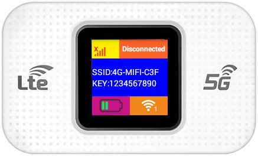

<br /> <p align="center"><a href="https://github.com/theXappy/MF800-LTE-5G-USB-MODEM" target="_blank"></a></p>

<p align="center"></a>
</p>

## Intro
I bought this "LTE '5G' USB Dongle WiFi" from AliExpress around 2024.  
Despite the branding, this stick can only use 3G/4G (and even that's questionable). 5G logic/settings are no where to be seen.  
After playing with it for a while, I decied to document all the quirks/tricks I've learned.  
SoC seems to be: `Qualcomm Snapdragon 410 (MSM8916)`  
USB Hardware IDs: `VID_05C6 PID_90B6`  
Modem Identifiers (fetched with AT commands):
```
ATI
Manufacturer: QUALCOMM INCORPORATED
Model: 4094
Revision: MF800_V2.0_21_V01R01B05  1  [Sep 07 2015 23:00:00]
SVN: 01
IMEI: +CGSN:860018046000213
+GCAP: +CGSM

AT^SWVER
^SWVER: MF800_V2.0

AT^HWVER
Part=206  version=1.0
```

## Table of Contents
### 🌐 Web App & ADB
1. See [UZ801-LTE-USB-MODEM](https://github.com/theXappy/UZ801-LTE-USB-MODEM?tab=readme-ov-file#-web-app--adb) with one note:  
  a. The APK for MF800 is slightly different. Specifically the ADB (and Diag, AT) enablement command (2001) invokes an AT command locally instead of running `setprop persist.sys.usb.config ...`)  
     The command is `AT+USB=1,268968726`. The second parameter is mandatory and I think it serves as a "password" to discourage some kind of attack.  
     Not sure which attack, since AT commands can't be issued from a PC *before* it is run, but maybe I'm missing another vector.


### ☎️ Modem
1. To get the modem's 'AT COM port' working, See [UZ801-LTE-USB-MODEM](https://github.com/theXappy/UZ801-LTE-USB-MODEM?tab=readme-ov-file#%EF%B8%8F-modem)
2. The list of supported AT commands differs, This models command [Modem drivers for Windows + AT Commands communication](Modem_AT_Commands.md).
3. The webserver's APK also tells us there's another way to reach the AT interface: via a shell command `at_modem <command>`  
   For example, `adb shell at_modem ATI` will invoke the `ATI` command. Output looks like this (note the first line, not part of AT protocol):
```
main,155: output=
Manufacturer: QUALCOMM INCORPORATED
Model: 4094
Revision: MF800_V2.0_21_V01R01B05  1  [Sep 07 2015 23:00:00]
SVN: 01
IMEI: +CGSN:860018046000213
+GCAP: +CGSM
```

### 📱Screen Control
1. See [UZ801-LTE-USB-MODEM](https://github.com/theXappy/UZ801-LTE-USB-MODEM?tab=readme-ov-file#screen-control)

### 🪄 Firmware Backup/Flashing
1. See [UZ801-LTE-USB-MODEM](https://github.com/theXappy/UZ801-LTE-USB-MODEM?tab=readme-ov-file#-firmware-backupflashing)

### ⚡ UART
UART pins are arrange in a rectangle, on the SIM slot side of the device.
Mapping, assuming the USB connector points to the right:  
* Top Left: GND
* Top Right: VCC
* Bottom Left: TX
* Bottom Right: RX  


Connect using default parameters in PuTTY except:
* Session -> Baud Rate: 115200
* Connection -> Serial -> Flow Control: None
You'll be greated with a shell, the user is `shell` and has the following `id` values:
```
shell@msm8916_32_512:/ $ id
uid=2000(shell) gid=1007(log) context=u:r:init_shell:s0
```
In comparison, ADB shell defaults to the `root` user and these values:
```
root@msm8916_32_512:/ # id
uid=0(root) gid=0(root) context=u:r:shell:s0
```
Anyway, using `su root` from the `shell` user just switches to root ¯\\\_(ツ)_/¯.
